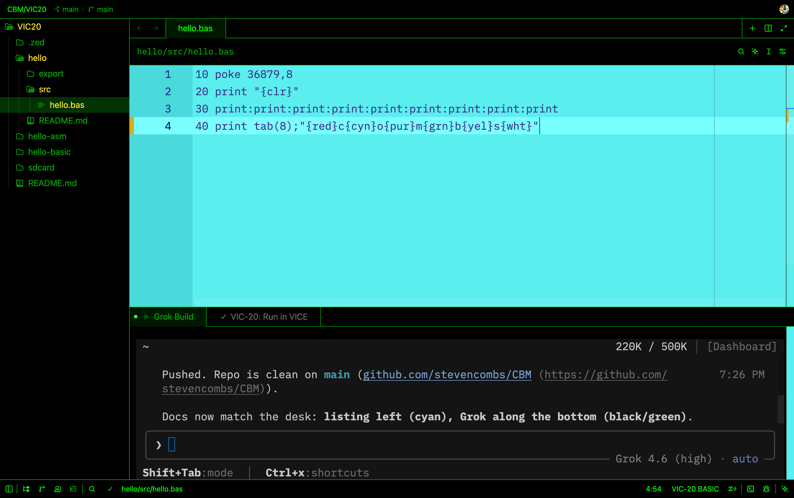

# CBM

Commodore **VIC-20** and **Commodore 64** programs, plus a local MCP server so [Grok Build](https://grok.x.ai/) can drive [VICE](https://vice-emu.sourceforge.io/) on a Mac.

Programs are written in BASIC 2.0 (`petcat`) and 6502 assembly (`64tass`). VICE’s window stays visible so you can watch; listings are never typed in. Source is tokenized or assembled to a `.prg` on the host, then injected into RAM.

This repository is meant to clone onto another Mac and keep working.

## Layout

```
CBM/
  C64/<program>/src/          BASIC .bas or 64tass .asm
  C64/<program>/export/       .prg and .d64
  VIC20/<program>/…           same shape
  mcp/vice/                   Python MCP server (stdio)
  zed/vic20-basic/            Zed theme, snippets; language **CBM BASIC**
  zed/c64-basic/              Zed theme, snippets; language **CBM BASIC**
  VIC20/.zed/                 workspace: cyan listing, phosphor Grok, tasks
  C64/.zed/                   workspace: blue listing, phosphor Grok, tasks
  grok/skills/cbm/            Grok skill (symlinked into ~/.grok/skills)
  grok/config.snippet.toml    MCP stanza for ~/.grok/config.toml
  scripts/install-macos.sh    Homebrew + venv + skill + grok mcp add
  scripts/retro               open a machine folder in Zed (`retro vic20` / `c64` / `mega65`)
  scripts/vic20.sh            VIC-20 Check / Run / Push / Push+run
  scripts/c64.sh              C64 Check / Run / Push / Push+run
  images/                     workspace screenshots
```

Default VIC-20 memory is **unexpanded 3.5K**. Ask for `8k` / `16k` / `24k` / `all` when a program needs it (that also moves the BASIC load address).

Machines are NTSC.

## Requirements (macOS)

- [Homebrew](https://brew.sh)
- [VICE](https://formulae.brew.sh/formula/vice) (`brew install vice`) — `x64sc`, `xvic`, `petcat`, `c1541`
- [64tass](https://formulae.brew.sh/formula/tass64) (`brew install tass64`)
- Python 3.10+ (Homebrew `python3` is fine)
- [Grok Build](https://grok.x.ai/) CLI for the MCP connection (local only; browser Grok cannot launch VICE)

## Install on a new Mac

```bash
git clone https://github.com/stevencombs/CBM.git ~/CBM
cd ~/CBM
chmod +x scripts/install-macos.sh
./scripts/install-macos.sh
```

The script:

1. `brew install vice tass64`
2. Creates `mcp/vice/.venv` and installs `mcp`
3. Symlinks `grok/skills/cbm` → `~/.grok/skills/cbm`
4. Runs `grok mcp add vice` when the `grok` CLI is on `PATH`

Then in Grok: **`/mcps` then `r`**, or start a new session.

If you prefer to edit config by hand, copy `grok/config.snippet.toml` into `~/.grok/config.toml` and replace `__CBM_ROOT__` / `__HOME__`.

## VIC-20 Zed beta

Listing left (cyan boot paper), Grok in the **bottom** terminal (black / green phosphor), Source Code Pro, autosave 1s. Zed 1.20 Agent chat uses the listing paper — leave it closed; use **task: spawn → Grok Build**.



```bash
./scripts/install-vic20-zed.sh
./scripts/retro vic20
```

In Zed: **Install Dev Extension** → `zed/vic20-basic`. Open `hello/src/hello.bas`. Tasks: **Check listing**, **Run in VICE**, **Push**, **Push+run** (you press Push; Grok does not). Details: [`zed/vic20-basic/README.md`](zed/vic20-basic/README.md).

## C64 Zed

Same desk as the VIC-20: listing left (**C64 Blue** boot paper), Grok in the **bottom** terminal. Sixteen colours (`{orng}`, `{lred}`, `{gry1}`…). Load `$0801`.

```bash
./scripts/install-c64-zed.sh
./scripts/retro c64
```

Install Dev Extension → `zed/c64-basic`. Tasks: **C64: Check listing**, **Run in VICE**, **Push**, **Push+run**. Details: [`zed/c64-basic/README.md`](zed/c64-basic/README.md).

## MEGA65 Zed

Same verbs and keys. Listing is **MEGA65 Dark** (navy / gold). Tokenize with `petcat -w65` (`$2001`). **Run** is XEMU; **Push** / **Push+run** are `etherload` / `etherload -r` (mega65-tools).

```bash
./scripts/retro mega65
```

Repo: [stevencombs/mega65-zed](https://github.com/stevencombs/mega65-zed) (override path with `MEGA65_ZED`). **⌘⇧G** still toggles Grok on the bottom.

## How a session works

1. Source lives in `C64/<name>/src` or `VIC20/<name>/src`.
2. On VIC-20 BASIC, review the listing in Zed first. Tokenize (`petcat -w2`) or assemble (`64tass --cbm-prg`) on Check / when asked.
3. **Run in VICE** autostarts the `.prg` (RAM inject, warp). Grok `load`s only if you ask.
4. Grok may type **commands** at `READY.` (`LIST`, `RUN`, `SYS 2064`) — not whole programs.
5. **Push** (your task) copies PRG/D64 to `VIC20/sdcard/` for SD2IEC / Pi1541.

Load addresses:

| Machine | BASIC start | Notes |
|---------|-------------|--------|
| C64 | `$0801` (2049) | Screen `$0400` |
| VIC-20 unexpanded | `$1001` (4097) | Screen `$1E00` |
| VIC-20 +3K | `$0401` (1025) | |
| VIC-20 +8K or more | `$1201` (4609) | Screen `$1000` |

## Export to real hardware

Build artifacts are in each program’s `export/` folder.

- **SD2IEC / Pi1541** (original VIC-20, or a breadbin C64): copy the `.prg` and/or `.d64` onto the SD card. Disk names are 16 characters, PETSCII-safe.
- **Commodore 64 Ultimate**: the same `.prg` / `.d64` on USB or SD. The File Browser can DMA-load a PRG; use a D64 when the program expects a disk. A LAN “send and RUN” path is planned and not in this tree yet.

Do not commit `.vice/` (runtime PID and screenshots). Do commit `export/*.prg` and `export/*.d64` so a clone is ready for an SD card without rebuilding.

## MCP tools (namespaced `vice__*`)

`start`, `stop`, `status`, `list_programs`, `new_program`, `tokenize`, `assemble`, `export_d64`, `load`, `type_keys`, `reset`, `screenshot`, `screen_text`, `peek`, `poke`, `registers`, `resume`.

The server speaks VICE’s **binary monitor** (API v2) on `127.0.0.1:6502`.

Homebrew GTK needs `GSETTINGS_SCHEMA_DIR` (see `grok/config.snippet.toml`). Without it, `x64sc` dies with “No GSettings schemas are installed”. Intel Homebrew uses `/usr/local` instead of `/opt/homebrew`.

## Attribution

- **Author:** Steven Combs ([retroCombs](https://www.retrocombs.com)), 2026.
- **AI collaboration:** This repository — including the MCP server, Grok skill, install script, and the sample `hello-*` programs — was designed and written with [xAI Grok Build](https://grok.x.ai/) (Grok 4.6) in a local Grok session. Review the git history for what the human committed.
- **Teaching voice:** In-session replies may follow the style of the late **Jim Butterfield**, whose books and *Transactor* work taught a generation of 6502 programmers. Butterfield did not write this software; the persona is tribute, not authorship.
- **VICE** (Versatile Commodore Emulator) is © the VICE team, GPL-2.0-or-later. `petcat` and `c1541` come with VICE.
- **64tass** (Turbo Assembler Macro) is © soci / the 64tass authors.
- **MCP** (Model Context Protocol) is the tool interface Grok uses to call this server.

Sample programs in this repo are MIT-licensed with the rest of the tree.

## License

MIT. See [LICENSE](LICENSE).
